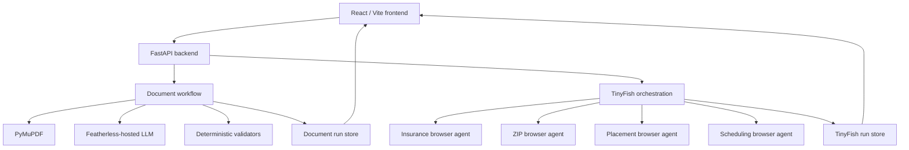

# careflow.ai

**Agentic referral intake for home health.**

careflow.ai turns a hospital discharge packet into an intake-ready home-health referral. It combines document understanding, deterministic validation, and browser agents so intake teams can move from an uploaded PDF to eligibility, placement, and scheduling in one traceable workflow.

**User:** home-health intake and operations teams.  
**Input:** hospital discharge / referral PDFs.  
**Output:** a structured referral, validated patient and service fields, payer and service-area checks, placement state, and scheduling handoff.

## Why it matters

Home-health referral intake is operationally dense. Staff often have to read multi-page discharge packets, recover text from scans, extract patient and insurance details, normalize requested services, verify whether the payer is accepted, check ZIP coverage, place the referral, and start scheduling.

careflow.ai compresses those handoffs into one system while keeping the workflow inspectable. The UI exposes agent state, observations, actions, logs, structured fields, and downstream operational decisions instead of hiding the process behind a single model response.

## End-to-end workflow

```mermaid
flowchart LR
    PDF[Referral PDF] --> Classify[PDF classification]
    Classify --> OCR[Direct text extraction / OCR]
    OCR --> Parse[Page-aware parsing]
    Parse --> LLM[LLM structured extraction]
    LLM --> Validate[Deterministic validation]
    Validate --> Review[Human review]
    Review --> Eligibility[Insurance + ZIP agents]
    Eligibility --> Placement[Referral placement]
    Placement --> Scheduling[Nurse + slot matching]
    Scheduling --> Complete[Intake-ready referral]
```



The document-understanding stage and the browser-automation stage are deliberately separated. LLM extraction converts unstructured referral text into a typed referral object, while deterministic rules validate critical fields before browser agents use that object for operational checks.

## Agentic document understanding

The referral pipeline is implemented as a traceable multi-stage workflow:

1. **OCR Agent** classifies the packet as digital, scanned, or mixed and extracts page text.
2. **Document Parsing Agent** builds merged and page-aware document context.
3. **LLM Extraction Agent** converts the parsed packet into structured referral JSON.
4. **Demographics Validation Agent** checks patient identity fields.
5. **Contact Validation Agent** validates phone and ZIP structure.
6. **Clinical Services Agent** normalizes requested services such as PT, OT, ST, and Skilled Nursing.
7. **Cross-Field Validator** finalizes the referral object for downstream operations.

The extracted schema includes patient demographics, MRN, contact information, address/ZIP, hospital, payer/member ID, requested services, physicians, diagnosis, discharge date, missing fields, validation notes, and per-field confidence.

## Browser agents

After document understanding, TinyFish agents perform operational checks against browser-based targets.

### Insurance Agent

Checks whether the extracted payer is accepted and returns structured evidence.

### ZIP Agent

Checks whether the patient's ZIP is serviceable and identifies the matching branch when available.

### Placement Agent

Carries the validated referral into the placement workflow using patient, payer, ZIP, and requested-service context.

### Scheduling Agent

Finds a matching nurse and visit slot, then initializes the scheduling handoff.

Insurance and ZIP checks run concurrently, reducing unnecessary serial waiting between independent eligibility checks.

## Resilience and fallback behavior

Browser-agent runs are streamed over SSE and tracked in the same visible agent-state model as the document pipeline.

careflow.ai includes bounded execution behavior for operational continuity:

- TinyFish runs expose live progress and browser-stream metadata.
- Remote runs are cancelled if they exceed the configured execution window.
- Insurance, ZIP, and scheduling workflows have deterministic local fallback datasets for timeout recovery.
- Workflow state is persisted in run stores so the frontend can poll and render current status.
- Errors are surfaced as workflow state rather than disappearing inside background execution.

This keeps the demo path responsive while preserving the distinction between browser-agent output and deterministic fallback decisions.

## Product flow

The frontend presents the referral as a sequence of operational stages:

```text
Landing
  -> Referral portal
  -> Referral detail
  -> Document processing
  -> Structured review
  -> Eligibility
  -> Placement
  -> Scheduling
  -> Complete
```

A user can upload a referral or launch the provided sample flow, inspect the extracted fields, review live agent traces, and continue through eligibility and scheduling from the same application.

## Architecture



## Design decisions

- **LLM extraction + deterministic validation:** the model handles messy document interpretation, while application code owns field validation and service normalization.
- **Page-aware parsing:** extracted text is retained with document structure instead of flattening every page into one opaque blob.
- **Independent browser agents:** payer and service-area checks are separate tasks and can execute concurrently.
- **Typed referral schema:** downstream automation operates on a Pydantic model instead of free-form model output.
- **Visible agent traces:** each stage exposes goal, task, observation, action, status, and updates so the workflow remains inspectable.
- **Bounded browser execution:** remote automation uses explicit time limits, cancellation, and deterministic fallback paths.
- **Human review before operations:** document understanding produces a structured referral that can be inspected before downstream eligibility and placement actions.

## Stack

**Frontend**

- React 19
- Vite
- React Router
- Tailwind CSS
- Framer Motion
- Lucide React

**Backend**

- FastAPI
- Uvicorn
- Pydantic
- PyMuPDF
- OpenAI-compatible client with Featherless
- TinyFish browser automation API
- HTTPX
- Server-Sent Events
- python-dotenv

## Run locally

### Backend

```bash
cd backend
python3 -m venv .venv
source .venv/bin/activate
pip install -r requirements.txt
```

Create `backend/.env`:

```bash
FEATHERLESS_API_KEY=your_featherless_key
FEATHERLESS_BASE_URL=https://api.featherless.ai/v1
FEATHERLESS_MODEL=Qwen/Qwen2.5-7B-Instruct

TINYFISH_API_KEY=your_tinyfish_key
TINYFISH_BASE_URL=https://agent.tinyfish.ai/v1

MOCK_INSURANCE_URL=http://localhost:8000/mock/insurance.html
MOCK_ZIPCODES_URL=http://localhost:8000/mock/zipcodes.html
MOCK_NURSES_URL=http://localhost:8000/mock/nurses.html
```

Start the API:

```bash
uvicorn app:app --reload --port 8000
```

### Frontend

From the repository root:

```bash
npm install
npm run dev
```

Open the Vite URL, usually:

```text
http://localhost:5173
```

## Demo path

For the fastest end-to-end walkthrough:

1. Open the portal and choose **Start Demo**.
2. Add or select the sample referral.
3. Run document processing.
4. Watch OCR, parsing, extraction, and validation agents update live.
5. Review the structured referral fields.
6. Continue to insurance and ZIP eligibility checks.
7. Run placement.
8. Continue to nurse/slot scheduling.
9. Inspect the completed workflow and event history.

## Key files

- [FastAPI entrypoint](backend/app.py)
- [Document workflow](backend/workflows/document_graph.py)
- [TinyFish orchestration](backend/services/tinyfish_service.py)
- [Referral schema](backend/models/referral.py)
- [Document routes](backend/routes/documents.py)
- [TinyFish routes](backend/routes/tinyfish.py)
- [Frontend route map](src/App.jsx)
- [Python dependencies](backend/requirements.txt)
- [Frontend dependencies](package.json)
